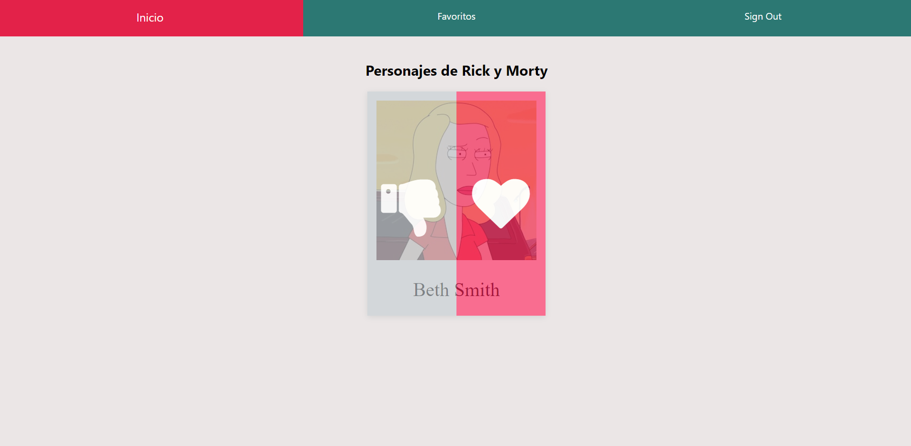

[![Contributors][contributors-shield]][contributors-url]
[![Forks][forks-shield]][forks-url]
[![Stargazers][stars-shield]][stars-url]
[![Issues][issues-shield]][issues-url]
[![LinkedIn][linkedin-shield2]][linkedin-url2]
[![Hireable][hireable]][hireable-url]

<!-- PROJECT LOGO -->
<br />
<p align="center">
 <h2 align="center"> React and redux API</h2>

  <p align="center">
      In this project We'll put together a request API with the middleware redux-thunk to  make requests in a redux application.
      We'll also use GraphQL to replace highlight the differences between axios and apollo to make API requests. 
    <br />
    <a href="https://github.com/YairFernando67/React-Redux-API-GraphQL"><strong>Explore the docs »</strong></a>
    <br />
    <br />
    <a href="https://github.com/YairFernando67/React-Redux-API-GraphQL">View Demo</a>
    ·
    <a href="https://github.com/YairFernando67/React-Redux-API-GraphQL/issues">Report Bug</a>
    ·
    <a href="https://github.com/YairFernando67/React-Redux-API-GraphQL/issues">Request Feature</a>
  </p>

</p>

## Table of Contents
* [About the Project](#about-the-project)
  * [Redux-Thunk](#Redux-Thunk)
  * [Middleware](#Middleware)
  * [Redux](#Redux)
  * [React-Redux](#React-Redux)
  * [React-Router](#React-Router)
  * [Built With](#built-with)
* [Required Installations](#Required-Installations)
  * [Installing](#Installing)
  * [Instructions](#Instructions)
* [Contact](#contact)
* [Contributing](#Contributing)
* [Show your support](#Show-your-support)

## About The Project

 

### Redux-Thunk 
Middleware to help us make requests 
in a redux application. Anytime that we expect to make an API request form an
actual creator we are always going to make use of redux-thunk. There are other
options that allow you to make API requests or otherwise async behaviors but
redux-thunk is the most popular.

### Middleware
Function that gets called with every action
we dispatch. Has the hability to stop, modify or
otherwise mess around with actions. A middleware is for
dealing with async actions.

### Redux
It is a state managment library, makes creating complex applications
easier, It is not required to create a react app, it is not
explicity designed to work with react.

### React-Redux
This is a third library that help us to let react and redux to comunicate to each other and work together

### React-Router
It is a library that allows a user to see different screens inside of 
our application.
Every time that we want to use react-router in our application to handle
navigation, we are always going to install this project called react-router-dom.

### Built With
The project was developed using the following technologies:
- [React](https://es.reactjs.org/)
- [JSX](https://reactjs.org/docs/introducing-jsx.html)
- [Axios](https://github.com/axios/axios)
- [GraphQl](https://graphql.org/)
- [Redux-Thunk](https://github.com/reduxjs/redux-thunk)
- [React-Redux](https://github.com/reduxjs/react-redux)
- [React-Router](https://github.com/ReactTraining/react-router/tree/master/packages/react-router-dom)
- [React-Apollo](https://github.com/apollographql/react-apollo)
- [Apollo-Client](https://github.com/apollographql/apollo-client/tree/master/packages/apollo-boost)


## Required Installations

### Installing

<p>Install the following to get this project running in your machine:</p>

### Instructions

<p>Follow these steps:</p>

Clone the Repository

```Shell
user@pc:~$ git clone https://github.com/YairFernando67/React-Redux-API-GraphQL
```

Click on the console and to go to the folder that was created

```Shell
user@pc:~$ cd React-Redux-API-GraphQL
```

```
user@pc:~/React-Redux-API-GraphQL$ npm install
```

```
user@pc:~/React-Redux-API-GraphQL$ npm start
```

Open your browser on [http://localhost:3000](http://localhost:3000)

## Contact

👤 **Yair Fernando Facio**

<a href="https://yairfernando67.github.io/Portfolio/" target="_blank">
    
   

</a>

- Github: [@YairFernando67](https://github.com/YairFernando67)
- Twitter: [@YairFernando18](https://twitter.com/YairFernando18)
- Linkedin: [softwaredeveloperyairfacio](https://www.linkedin.com/in/softwaredeveloperyairfacio/)
- Email: [yair.facio11@gmail.com](https://mail.google.com/mail/?view=cm&fs=1&tf=1&to=yair.facio11@gmail.com)
- Portfolio: [softwaredeveloper](https://yairfernando67.github.io/Portfolio/)

<p align="center">

  Project Link: [https://github.com/YairFernando67/React-Redux-API-GraphQL](https://github.com/YairFernando67/React-Redux-API-GraphQL)

</p>

## 🤝 Contributing

Contributions, issues and feature requests are welcome!

Feel free to check the [issues page](https://github.com/YairFernando67/React-Redux-API-GraphQL/issues).

## Show your support

Give a ⭐️ if you like this project!

<!-- MARKDOWN LINKS & IMAGES -->
[contributors-shield]: https://img.shields.io/github/contributors/YairFernando67/React-Redux-API-GraphQL.svg?style=flat-square
[contributors-url]: https://github.com/YairFernando67/React-Redux-API-GraphQL/graphs/contributors
[forks-shield]: https://img.shields.io/github/forks/YairFernando67/React-Redux-API-GraphQL.svg?style=flat-square
[forks-url]: https://github.com/YairFernando67/React-Redux-API-GraphQL/network/members
[stars-shield]: https://img.shields.io/github/stars/YairFernando67/React-Redux-API-GraphQL.svg?style=flat-square
[stars-url]: https://github.com/YairFernando67/React-Redux-API-GraphQL/stargazers
[issues-shield]: https://img.shields.io/github/issues/YairFernando67/React-Redux-API-GraphQL.svg?style=flat-square
[issues-url]: https://github.com/YairFernando67/React-Redux-API-GraphQL/issues
[license-shield]: https://img.shields.io/github/license/YairFernando67/React-Redux-API-GraphQL.svg?style=flat-square
[license-url]: https://github.com/YairFernando67/React-Redux-API-GraphQL/blob/master/LICENSE.txt
[linkedin-shield2]: https://img.shields.io/badge/-LinkedIn-black.svg?style=flat-square&logo=linkedin&colorB=555
[linkedin-url2]: https://www.linkedin.com/in/softwaredeveloperyairfacio/
[hireable]: https://cdn.rawgit.com/hiendv/hireable/master/styles/flat/yes.svg
[hireable-url]: https://www.linkedin.com/in/softwaredeveloperyairfacio/
